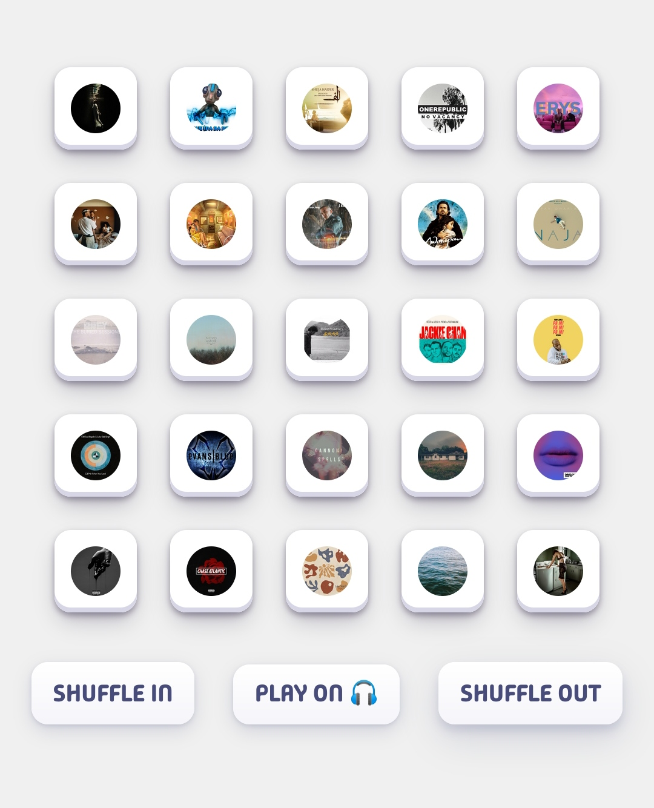

<h1 align="center"></h1>

<p align="center"><strong>WRAPPED OF SPOTIFY WRAPPED</strong></p>

<p align="center"><a href="https://yourtopsongs.vercel.app"><b> Click here! </b></a></p>

## Features:

I built it for personal use, but it -

- Scrapes all of your Spotify Wrapped playlists.
- Generates a frontend interface.
- Displays a randomized selection of song previews.
- Allows listening to the previews (*without relying upon Spotify API*) and opening favorite songs for full playback.

## Installation:

- Clone the repository:

```bash
$ git clone https://github.com/CodeDotJS/YourTopSongs.git
```

- Generate the required credentials from [here](https://developer.spotify.com/dashboard/create).

- Create an `.env` file in `scrapper/` and open it using your go-to text editor -

```bash
$ cd YourTopSongs
$ subl scrapper/.env
```

-  Enter your credentials obtained and save the file.

```
CLIENT_ID=YOUR CLIENT ID
CLIENT_SECRET=YOUR CLIENT SECRETE
REDIRECT_URI=YOUR REDIRECT URI
```

__Note:__ Credentials are only required once to generate the JSON for all of your Wrapped playlists. Playing songs does not require any access token.

## Run:

```sh
$ chmod +x run.sh

$ ./run.sh
```

Open your web browser and go to http://localhost:5000


## Screenshot:

<p align="center"></p>

## Contributing:

- You know the deal.

## License:

MIT
